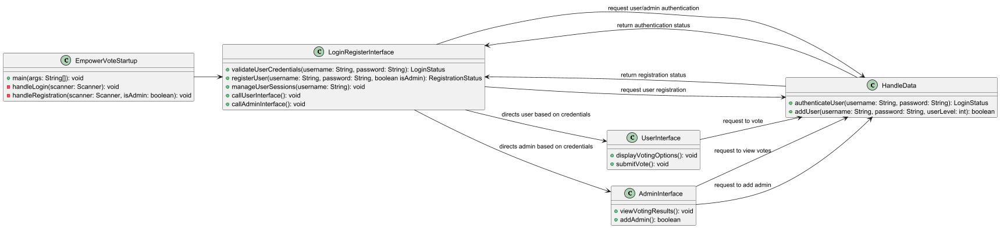
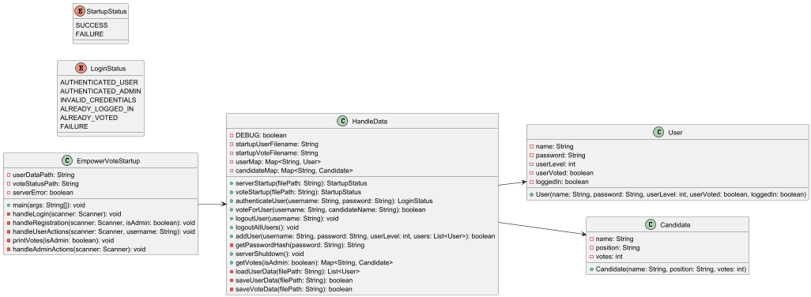

# EmpowerVote Project Client

## Overview
The `src` folder contains all the source code for the EmpowerVote client. This includes the main application code, user interfaces, controllers, models, and services. The code is organized to maintain a clear structure and separation of concerns, making it easier to navigate, develop, and maintain.

### Phase I
Phase I focuses on the backend logic of the EmpowerVote project, which includes handling user authentication, voting, and administrative functionalities. The client-side implementation is a GUI-based desktop application.

### Phase II
Phase II introduces more advanced features such as multi-language support, improved accessibility, and a more refined user experience. This will provide users with a more robust and intuitive interface.

## Files

### EmpowerVoteClient.java
This is the main class for the EmpowerVote client application. It establishes the connection to the server and initializes the user interface. It is responsible for setting up the initial user interaction (i.e., login screen), managing server connections, and delegating tasks to the appropriate components based on the user’s actions.

### ClientSocketHandler.java
This class handles the socket connection between the client and the server. It manages input and output streams, sending and receiving messages from the server, and ensuring that the communication protocol is followed. It also manages incoming messages and forwards them to relevant UI components for display.

### StartupLogin.java
This class manages the user login interface. It handles the login screen where users can enter their credentials. After successful authentication, it transitions the user to the appropriate next screen (either the voting interface or the admin dashboard). It validates the entered credentials, communicates with the server to authenticate, and handles errors related to login failure.

## UML Diagrams

### Simple UML Diagram

### Complete UML Diagram

