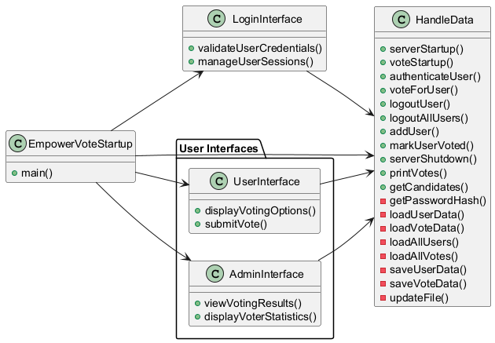

# src Folder

## Overview
The `src` folder contains all the source code for the EmpowerVote project. This includes the main application code, controllers, models, repositories, and services. The code is organized to maintain a clear structure and separation of concerns, making it easier to navigate, develop, and maintain.

## Files

### EmpowerVoteStartup.java
This is the main class for the Spring Boot application. It contains the `main` method that starts the application.

### UserInterface.java
This class handles the user voting functionality, including displaying voting language options and submitting votes.

### AdminInterface.java
This class handles the admin functionality, including viewing voting results and displaying voter statistics.

### LoginInterface.java
This class handles the login functionality, including validating user credentials and managing user sessions.

### HandleData.java
This service class handles data-related operations, including finding users, saving users, and securing passwords. It also includes methods for server startup and shutdown, user authentication, voting, and data persistence.

## UML Diagram

