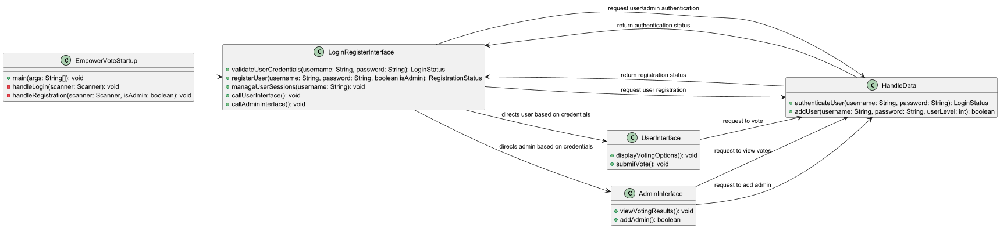

# EmpowerVote Project

## Capstone CMSC495
## Team Members

| Role                      | Name                |
|---------------------------|---------------------|
| Project Manager (PM)      | Johnson, Shakenia   |
| Test Director (TD)        | Barnes, Mahogany    |
| Software Designer (SD)    | Friedman, Marc      |
| Software Designer (SD)    | Hitchcox, Jacob     |
| RM / Technical Writer     | Bias, Ashley        |


## Overview
EmpowerVote is a comprehensive voting system application designed to provide a secure and user-friendly experience for voters, administrators, and system users. The project includes graphical user interfaces (GUIs) for login, voting, and viewing results, along with backend functionality for user authentication, vote submission, and data security.

## Features
- **Login GUI:** User-friendly interface for logging in with username and password.
- **Admin GUI:** Secure interface for viewing voting results, including a dashboard with voter statistics.
- **User Voting GUI:** Intuitive interface for casting votes.
- **Backend for Authentication:** Secure login and session management which integrates the user interfaces.
- **Encryption and Hashing:** Encryption for sensitive data and hashing for passwords.
- **Multilingual Support:** Interface translation into English, Spanish, and Russian.
- **Testing Framework:** Configured testing framework with unit tests for critical components.
- **Documentation:** Comprehensive user and admin guides.

## Installation
1. Install Java Development Kit (JDK):
   - Download and install the latest version of JDK from the [Oracle website](https://www.oracle.com/java/technologies/javase-downloads.html).

2. Clone the repository:
   ```
   git clone https://github.com/yourusername/EmpowerVote.git
   cd EmpowerVote
   ```

## Project Structure
- **docs:** Contains the user guide and test guide.
- **src:** All code for the project.
- **test:** Contains the test cases.
- **resource:** Contains the user data and current votes.

## UML Diagram


## Sequence Diagram
